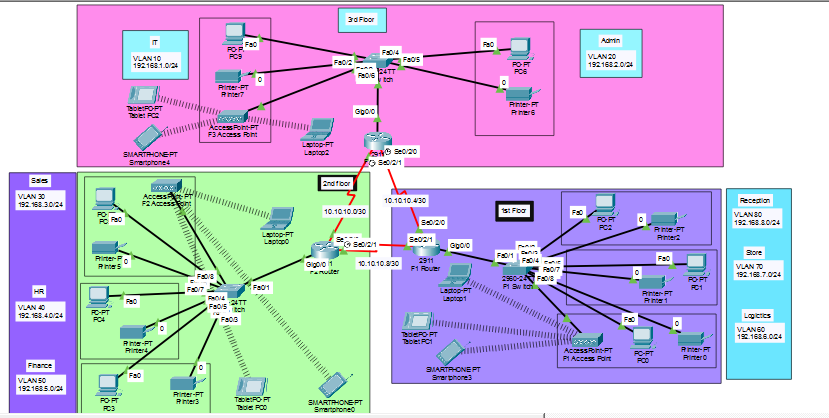

# 🏨 Hotel Network Design Project (Cisco Packet Tracer)

## 📌 Overview

This project presents a **complete enterprise-level network design** for a modern hotel/office environment built using Cisco Packet Tracer.

The network is designed across **three floors**, each containing multiple departments. The goal of this lab was to simulate how real organizations design scalable, secure, and efficient networks using industry-standard technologies.

Through this project, I implemented both **networking fundamentals and basic cybersecurity practices**, ensuring proper segmentation, secure access, and reliable communication between all departments.

---

## 🎯 Objectives

* Design a structured multi-floor network
* Implement VLAN-based segmentation for departments
* Enable communication across floors using dynamic routing
* Automate IP addressing using DHCP
* Secure remote access using SSH
* Apply basic network security using port security
* Simulate real-world enterprise network behavior

---

## 🧠 Key Features & Technologies

### 🔹 VLAN Segmentation

Each department is isolated using VLANs to improve:

* Security (no unnecessary access between departments)
* Performance (reduced broadcast domains)
* Network organization

---

### 🔹 Inter-VLAN Routing (Router-on-a-Stick)

Routers are configured with sub-interfaces using **802.1Q encapsulation** to allow communication between VLANs.

---

### 🔹 Dynamic Routing (OSPF)

* OSPF (Open Shortest Path First) is used as the routing protocol
* All routers are connected in **Area 0 (Backbone Area)**
* Enables automatic route sharing and scalability

---

### 🔹 DHCP (Dynamic Host Configuration Protocol)

Each router acts as a DHCP server for its floor:

* Devices automatically receive IP addresses
* Reduces manual configuration
* Ensures proper network management

---

### 🔹 SSH (Secure Remote Access)

* SSH is configured on all routers
* Allows secure remote login instead of Telnet
* Tested using a dedicated **Test-PC in IT department**

---

### 🔹 Port Security (Layer 2 Security)

Implemented on IT department switch:

* Only **1 device allowed**
* Uses **sticky MAC address**
* Violation mode: **shutdown**

This prevents unauthorized devices from connecting.

---

### 🔹 Wireless Connectivity

Each floor includes wireless access points:

* Laptops and smartphones connect via WiFi
* Simulates modern office/hotel environment

---

## 🏢 Network Structure

### 🥇 1st Floor (Customer & Operations)

* VLAN 80 → Reception → 192.168.8.0/24
* VLAN 70 → Store → 192.168.7.0/24
* VLAN 60 → Logistics → 192.168.6.0/24

---

### 🥈 2nd Floor (Business Departments)

* VLAN 50 → Finance → 192.168.5.0/24
* VLAN 40 → HR → 192.168.4.0/24
* VLAN 30 → Sales/Marketing → 192.168.3.0/24

---

### 🥉 3rd Floor (Core Management & IT)

* VLAN 10 → IT → 192.168.1.0/24
* VLAN 20 → Admin → 192.168.2.0/24

---

## 🌐 Network Architecture & Routing

* **3 × Cisco 2911 Routers** (one per floor)
* Connected using **serial links with /30 subnets**
* Efficient IP usage for point-to-point communication

### 🔗 Router Interconnections

* 10.10.10.0/30
* 10.10.10.4/30
* 10.10.10.8/30

### 📡 Routing Protocol

* OSPF Process ID: 10
* Area: 0 (Backbone)

All VLAN networks and inter-router links are advertised dynamically.

---

## 🔐 Security Implementation

### ✅ SSH Configuration

* Secure login enabled on all routers
* Local user authentication configured
* RSA keys generated for encryption

---

### ✅ Port Security

* Applied to IT switch port connected to Test-PC
* Limits access to a single authorized device
* Automatically shuts down port on violation

---

## 🧪 Testing & Verification

The network was tested to ensure full functionality:

* ✅ All devices receive IP addresses via DHCP
* ✅ Devices within VLANs communicate successfully
* ✅ Inter-VLAN communication works correctly
* ✅ Cross-floor communication via OSPF verified
* ✅ SSH remote login tested from Test-PC
* ✅ Port security successfully blocks unauthorized devices

---

## 🖼️ Network Topology



---

## 📂 Project Structure

```
hotel-network-design/
├── README.md
├── topology/
├── configs/
├── docs/
└── packet-tracer-file/
```

---

## 🚀 How to Run the Project

1. Open the `.pkt` file using Cisco Packet Tracer
2. Wait for all devices to initialize
3. Use **Simulation Mode** to observe packet flow
4. Test connectivity using:

   * `ping`
   * `ssh`
5. Verify routing tables and DHCP assignments

---

## 🎯 Skills Demonstrated

* Network Design & Architecture
* VLAN Configuration & Subnetting
* Routing Protocols (OSPF)
* Network Security Fundamentals
* Troubleshooting & Testing
* Cisco Device Configuration

---

## 👨‍💻 Author

**Muhammad Muhammad**
Cybersecurity & Networking Learner
